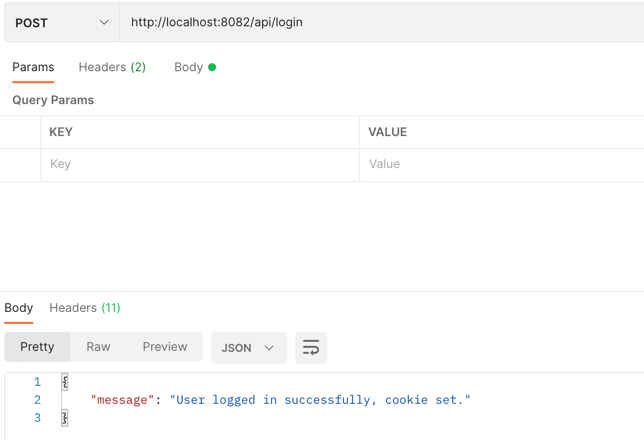
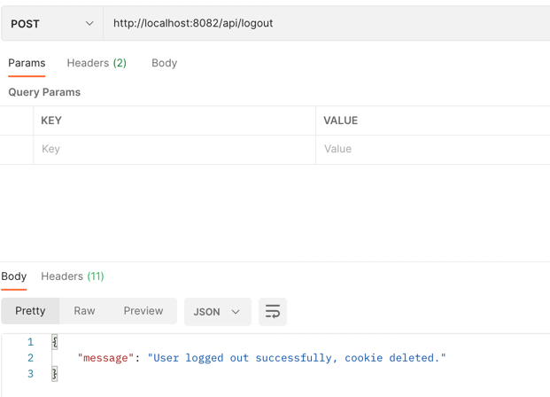
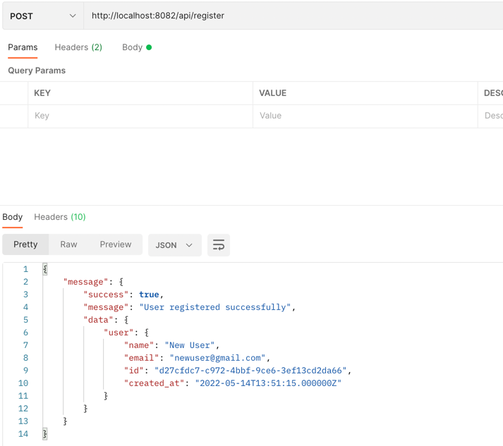
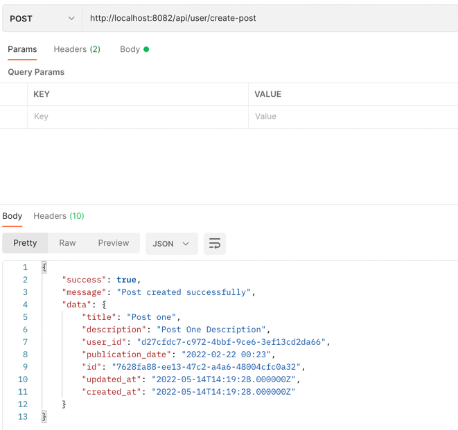
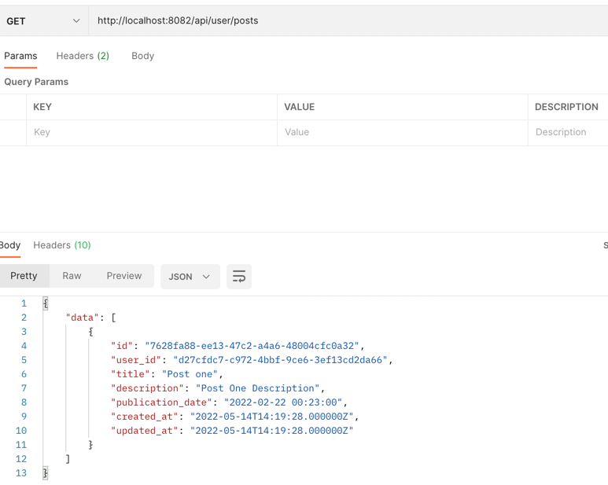
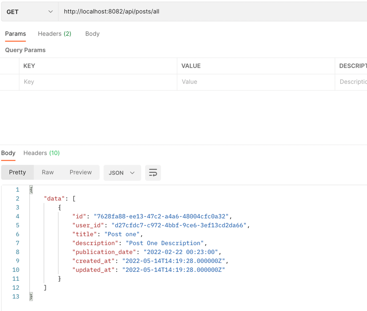

# About
This is a microservice that will be used to store and retrieve posts. It is also
connected to a docker network that will be used to connect to the User Microservice.

## Responsibilities
* Store posts
* Retrieve posts
* Connect to the User Microservice
* Connect to the Docker Network
* Connect to a Redis Cache 
* Trigger job events for automated posts import using schedular / cron job.
* Autoimport posts from a remote source.

## Directories and Files to Be Aware of:
* `/app/Console/Commands/AutoImportPost.php` - The command that will be used to trigger the job.
* `/app/Console/Kernel.php` - cron job will be triggered from this file.
* `/app/Http/` - The controllers, middleware, requests and resources will be used from this directory.
* `/app/Jobs/` - The jobs will be used from this directory.
* `/app/Models/` - The models will be used from this directory.
* `/app/Services/` - The services which extracts the business logic.
* `/app/Traits/` - The traits will be used from this directory.
* `/app/routes/api.php` - The routes will be used from this file.

## Api Endpoints
The application is built with RESTful API endpoints. No frontend is built due to the simplicity of the application and time constraints.

### The Login Endpoint

### Logout Endpoint

### New User Registration Endpoint

### User Create Post

### User's Posts

### Get all posts

